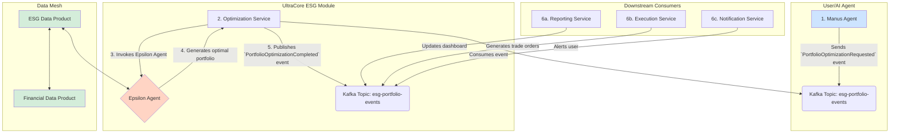

# UltraCore ESG Optimization: Kafka & DataMesh Integration Plan

This document details the next steps for fully integrating the RL-powered `optimize_portfolio_esg()` tool into the UltraCore event-sourcing architecture. The goal is to transform the synchronous MCP tool into a fully asynchronous, event-driven workflow that leverages Kafka and the DataMesh for scalability, auditability, and real-time performance.

## 1. Target Architecture: Asynchronous ESG Optimization Workflow

The new architecture will be a closed-loop, event-driven system:



### Workflow Steps:

1.  **Request:** An AI agent (or a user via a UI) initiates an optimization by publishing a `PortfolioOptimizationRequested` event to the `esg-portfolio-events` Kafka topic.
2.  **Consumption:** A dedicated **Optimization Service** (a Kafka consumer) picks up the request.
3.  **Optimization:** The service invokes the **Epsilon Agent**, which queries the **ESG and Financial Data Products** from the Data Mesh to get the latest data for its state representation.
4.  **Generation:** The Epsilon Agent runs its inference and generates the optimal portfolio weights.
5.  **Publication:** The Optimization Service publishes a `PortfolioOptimizationCompleted` event, containing the full optimization results (new portfolio, trade list, metrics, explanation).
6.  **Downstream Processing:** Multiple downstream services react to the completion event in parallel:
    *   The **Reporting Service** consumes the event to update the user's real-time dashboard.
    *   The **Execution Service** consumes the event to generate and stage trade orders.
    *   The **Notification Service** alerts the user that their optimization is complete.

### Advantages of this Architecture:

*   **Asynchronous & Scalable:** The system can handle thousands of concurrent optimization requests without blocking. New optimization services can be added to scale horizontally.
*   **Decoupled:** Services are completely decoupled. The optimization service doesn't need to know about reporting, execution, or notifications.
*   **Auditable:** Every request and result is an immutable event stored in Kafka, providing a perfect audit trail.
*   **Resilient:** If a downstream service fails (e.g., reporting), it doesn't affect the core optimization workflow. It can simply replay events from Kafka once it recovers.

## 2. Implementation Plan: Phase by Phase

### Phase 1: Define New Kafka Events

We need to add two new event types to our `PortfolioEventType` enum in `src/ultracore/esg/events/schemas.py`:

```python
class PortfolioEventType(str, Enum):
    # ... existing event types
    PORTFOLIO_OPTIMIZATION_REQUESTED = "portfolio_optimization_requested"
    PORTFOLIO_OPTIMIZATION_COMPLETED = "portfolio_optimization_completed"
```

The payload for `PORTFOLIO_OPTIMIZATION_REQUESTED` will contain the `current_portfolio` and `objectives`. The payload for `PORTFOLIO_OPTIMIZATION_COMPLETED` will contain the full optimization result from the `optimize_portfolio_esg` tool.

### Phase 2: Create the Optimization Service (Kafka Consumer)

This will be a new Python service that acts as a long-running Kafka consumer.

**File:** `src/ultracore/esg/optimization_service.py`

```python
import json
from kafka import KafkaConsumer, KafkaProducer
from ultracore.esg.mcp.portfolio_optimizer import EsgPortfolioOptimizer
# ... other imports

class OptimizationService:
    def __init__(self):
        self.consumer = KafkaConsumer(
            "esg-portfolio-events",
            bootstrap_servers="localhost:9092",
            value_deserializer=lambda m: json.loads(m.decode("utf-8"))
        )
        self.producer = KafkaProducer(
            bootstrap_servers="localhost:9092",
            value_serializer=lambda m: json.dumps(m).encode("utf-8")
        )
        # Initialize optimizer...
        self.optimizer = EsgPortfolioOptimizer(...)

    def run(self):
        for message in self.consumer:
            event = message.value
            if event["event_type"] == "portfolio_optimization_requested":
                self.handle_optimization_request(event)

    def handle_optimization_request(self, request_event):
        # Extract data from the request event
        portfolio = request_event["payload"]["current_portfolio"]
        objectives = request_event["payload"]["objectives"]

        # Run optimization
        result = self.optimizer.optimize(portfolio, objectives)

        # Create completion event
        completion_event = {
            "event_type": "portfolio_optimization_completed",
            "timestamp": datetime.now().isoformat(),
            "portfolio_id": request_event["portfolio_id"],
            "payload": result
        }

        # Publish completion event
        self.producer.send("esg-portfolio-events", completion_event)
```

### Phase 3: Integrate with the Data Mesh

The `EsgPortfolioOptimizer` currently uses mock data. We need to update the `_build_state` method to query the real Data Mesh.

**File:** `src/ultracore/esg/mcp/portfolio_optimizer.py`

```python
# In EsgPortfolioOptimizer._build_state()

# Replace mock data generation with this:

# 1. Query Financial Data Product
# In production, this would use a Data Mesh client (e.g., Databricks API, S3 select)
financial_df = pd.read_parquet(
    f"{self.data_mesh_path}/financial_data_product.parquet",
    filters=[("isin", "in", self.asset_universe), ("date", ">", end_date - timedelta(days=self.lookback_days))]
)

# 2. Query ESG Data Product
esg_df = pd.read_parquet(
    f"{self.data_mesh_path}/esg_data_product.parquet",
    filters=[("isin", "in", self.asset_universe)]
)

# 3. Join and pivot data to build the state vector
# ... (data manipulation logic)
```

This change ensures the Epsilon Agent is always training and running on the most up-to-date, unified data from the Data Mesh.

### Phase 4: Update the MCP Tool

The `optimize_portfolio_esg` MCP tool will be simplified. Instead of running the optimization synchronously, it will simply publish the `PortfolioOptimizationRequested` event to Kafka.

**File:** `src/ultracore/esg/mcp/esg_tools.py`

```python
# In EsgMcpTools.optimize_portfolio_esg()

# Replace synchronous call with event publishing:

request_event = {
    "event_type": "portfolio_optimization_requested",
    "timestamp": datetime.now().isoformat(),
    "portfolio_id": portfolio_id, # Add portfolio_id to arguments
    "payload": {
        "current_portfolio": current_portfolio,
        "objectives": objectives,
        "constraints": constraints
    }
}

# Get a Kafka producer and publish
self.producer.send("esg-portfolio-events", request_event)

return {
    "status": "pending",
    "message": "Portfolio optimization request has been submitted. You will be notified upon completion.",
    "request_id": request_event["timestamp"] # Return a request ID for tracking
}
```

This makes the MCP tool extremely fast and responsive, as it offloads the heavy computation to the background Optimization Service.

## 3. Deployment & Testing Strategy

1.  **Infrastructure Setup:**
    *   Deploy a Kafka cluster (or use a managed service like Confluent Cloud).
    *   Set up the Data Mesh storage (e.g., S3 buckets for Parquet files).
    *   Create a CI/CD pipeline to build and deploy the Optimization Service as a containerized application (e.g., Docker on Kubernetes).

2.  **Data Pipeline Implementation:**
    *   Build the data pipelines that create the `financial_data_product.parquet` and `esg_data_product.parquet` files in the Data Mesh.

3.  **End-to-End Testing:**
    *   **Test Case 1 (Happy Path):**
        1.  An agent calls `optimize_portfolio_esg` via MCP.
        2.  Verify the `PortfolioOptimizationRequested` event is published to Kafka.
        3.  Verify the Optimization Service consumes the event.
        4.  Verify the service queries the Data Mesh correctly.
        5.  Verify the `PortfolioOptimizationCompleted` event is published.
        6.  Verify downstream services (e.g., a mock reporting service) consume the completion event.
    *   **Test Case 2 (Service Failure):**
        1.  Run the happy path test, but kill the Optimization Service after it consumes the request.
        2.  Restart the service.
        3.  Verify that it re-processes the original request from Kafka, demonstrating resilience.

## 4. Summary of Deliverables

*   **Code:**
    *   Updated `schemas.py` with new event types.
    *   New `optimization_service.py` Kafka consumer.
    *   Updated `portfolio_optimizer.py` to read from the Data Mesh.
    *   Updated `esg_tools.py` to publish events asynchronously.
*   **Infrastructure:**
    *   Terraform or CloudFormation scripts for deploying Kafka and the Optimization Service.
*   **Documentation:**
    *   This integration plan.
    *   A new `DEPLOYMENT_GUIDE.md` explaining how to set up and run the entire event-driven workflow.

By following this plan, we will transform the powerful `optimize_portfolio_esg` tool into a robust, scalable, and fully event-driven component of the UltraCore ecosystem, solidifying its architectural superiority.


## 5. Code Implementation

The following code files have been created to implement the integration plan:

*   `src/ultracore/esg/events/schemas.py`: Updated with `PORTFOLIO_OPTIMIZATION_REQUESTED` and `PORTFOLIO_OPTIMIZATION_COMPLETED` event types.
*   `src/ultracore/esg/services/optimization_service.py`: The Kafka consumer service that runs the optimization.
*   `src/ultracore/esg/data/data_mesh_client.py`: The client for accessing the Data Mesh.
*   `src/ultracore/esg/mcp/portfolio_optimizer.py`: Updated to use the Data Mesh client.
