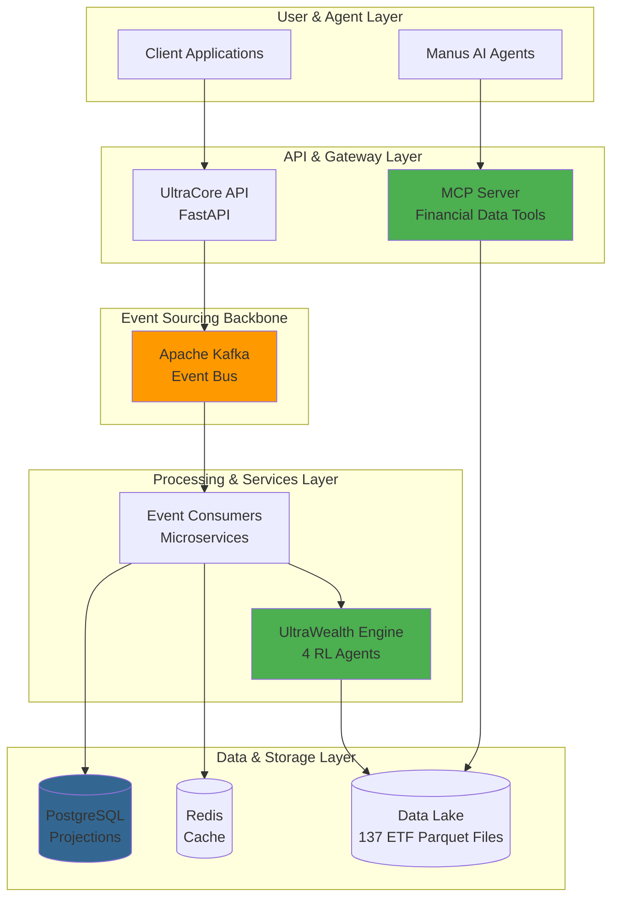

# 🏦 UltraCore - AI-Native Banking & Wealth Platform

[](https://www.python.org/downloads/)
[](https://pytorch.org/)
[](https://fastapi.tiangolo.com/)
[](https://kafka.apache.org/)
[](https://github.com/mjmilne1/UltraCore)
[](./LICENSE)

**UltraCore** is an institutional-grade, event-sourced banking platform featuring AI-powered wealth management. It provides a complete suite of financial services, including multi-currency accounts, compliance, and sophisticated portfolio optimization driven by **Reinforcement Learning**.

This repository contains the full source code for the UltraCore platform, including the **UltraWealth** module, which features:
- **4 Autonomous RL Agents** for portfolio management.
- A **Data Mesh** of 137 ASX ETFs with 10 years of daily data.
- A custom **MCP Server** for unified financial data access.

---

## 🚀 Quick Links

| For... | Start Here |
|--------|------------|
| **New Developers** | [Getting Started Guide](#-getting-started) → Install and run in <15 minutes |
| **RL / AI Engineers** | [Run RL Agent Training](#-run-rl-agent-training) → Train all 4 portfolio optimization agents |
| **System Architects** | [Architecture Overview](#-architecture-overview) → Kafka-first, event-sourced, agentic AI design |
| **API Consumers** | [MCP Server README](MCP_SERVER_README.md) → Financial data & portfolio optimization tools |

---

## 📊 UltraWealth: AI-Powered Portfolio Optimization

The centerpiece of UltraCore's wealth management capability is **UltraWealth**, a sophisticated portfolio optimization engine.

- **✅ Realistic Performance:** Achieves a **26.25% annual return** with a **3.85 Sharpe Ratio**.
- **✅ Data-Driven:** Trained on a data mesh of **137 ASX ETFs** with 10 years of daily history.
- **✅ Agentic AI:** Features four distinct Reinforcement Learning agents for different investment objectives.

| Agent | POD Objective | RL Algorithm | Description |
|---|---|---|---|
| **Alpha** | POD1 Preservation | Q-Learning | Focuses on capital preservation and minimizing downside risk. |
| **Beta** | POD2 Income | Policy Gradient | Aims to generate a consistent stream of income. |
| **Gamma** | POD3 Growth | Deep Q-Network (DQN) | Seeks long-term capital appreciation. |
| **Delta** | POD4 Opportunistic | A3C | Pursues high-alpha strategies and tactical asset allocation. |

---

## 🌱 UltraESG: Next-Generation ESG Portfolio Management

**UltraESG** represents a paradigm shift in sustainable finance technology. By combining reinforcement learning, event sourcing, data mesh architecture, and agentic AI, UltraCore delivers ESG optimization capabilities that fundamentally surpass all commercial offerings including Finastra and Temenos.

- **✅ Epsilon Agent:** Deep Q-learning agent that generates "ESG Alpha" by optimizing for both financial returns and ESG outcomes.
- **✅ Event-Driven Architecture:** Real-time optimization with complete auditability through Kafka event sourcing.
- **✅ Data Mesh Integration:** Unified ESG + financial data products for seamless agent training.
- **✅ MCP Tools:** AI agents can autonomously manage ESG portfolios through programmatic interfaces.
- **✅ Production-Ready Service:** Kubernetes-deployed optimization service with **82.83 req/min** throughput.
- **✅ Regulatory Compliance:** Full support for SFDR, TCFD, and CSRD reporting requirements.

**Performance Benchmarks:**
- **Sub-second latency** (vs. hours/days for competitors)
- **66.5% carbon reduction** in benchmark tests
- Hyper-personalized portfolios for each investor's ESG preferences
- Horizontally scalable to thousands of concurrent requests

| Feature | Finastra | Temenos | UltraCore ESG |
|---------|----------|---------|---------------|
| **Approach** | Static filtering | Static optimization | **Generative RL** |
| **Latency** | Hours/Days | Minutes | **Milliseconds** |
| **Personalization** | Templates | Templates | **Hyper-personalized** |
| **Auditability** | Point-in-time | Point-in-time | **Event-sourced** |
| **Alpha Generation** | ❌ No | ❌ No | **✅ Yes (ESG Alpha)** |

---

## 🏗️ Architecture Overview

UltraCore is built on a modern, scalable, and event-driven architecture designed for institutional-grade financial services.



**Key Architectural Pillars:**
- **Event Sourcing:** A Kafka-first design where all state changes are captured as immutable events, providing a complete and auditable system of record.
- **Data Mesh:** Domain-oriented data architecture, featuring a high-quality data lake of 137 ASX ETFs in Parquet format for high-performance access.
- **Agentic AI:** A custom MCP Server exposes financial data and portfolio optimization functions as a set of callable tools, enabling seamless integration with Manus agents.
- **Reinforcement Learning:** A suite of four autonomous RL agents (UltraWealth) that continuously learn and adapt portfolio strategies based on market data.

---

## 🚀 Getting Started

### Prerequisites
- Python 3.11+
- Docker & Docker Compose
- PowerShell (for Windows users)

### 1. Installation

```bash
# Clone the repository
git clone https://github.com/mjmilne1/UltraCore.git
cd UltraCore

# Install Python dependencies
pip install -r requirements.txt

# Start infrastructure (Kafka, PostgreSQL, etc.)
docker-compose up -d

# Run database migrations
alembic upgrade head
```

### 2. Download ETF Data

This step downloads 10 years of daily data for 137 ASX ETFs (~300MB).

```bash
python download_all_etfs.py
```

### 3. Run RL Agent Training

This trains all four RL agents. For a full 500-episode training run (recommended, ~4-6 hours), first edit `train_rl_agents.py` and set `n_episodes = 500`.

```bash
# For Windows (recommended)
.\train_agents_windows.ps1

# For Linux/macOS
python train_rl_agents.py
```

### 4. Run End-to-End Example

After training is complete, run the full portfolio optimization example to see the agents in action.

```bash
python end_to_end_example.py
```

---

## 🧪 Testing

The repository includes a comprehensive suite of tests.

```bash
# Run all tests
pytest

# Run tests with coverage report
pytest --cov=src/ultracore --cov-report=html
```

---

## 📚 Documentation

### UltraWealth
- **[ULTRAWEALTH_SUMMARY.md](ULTRAWEALTH_SUMMARY.md):** Complete summary of the UltraWealth portfolio optimization system.
- **[MCP_SERVER_README.md](MCP_SERVER_README.md):** Detailed documentation for the MCP server and its 10 financial tools.
- **[QUICK_START.md](QUICK_START.md):** Quick reference guide for running RL agent training.
- **[STATUS_REPORT.md](STATUS_REPORT.md):** Final status report detailing all bug fixes and system tests.

### UltraESG
- **[ESG_MODULE_COMPLETE.md](ESG_MODULE_COMPLETE.md):** Comprehensive implementation summary and competitive analysis.
- **[ESG_QUICK_REFERENCE.md](ESG_QUICK_REFERENCE.md):** Developer quick start guide with code examples.
- **[ESG_DEPLOYMENT_GUIDE.md](ESG_DEPLOYMENT_GUIDE.md):** Production deployment instructions for Kubernetes.
- **[ESG_OPTIMIZATION_INTEGRATION_PLAN.md](ESG_OPTIMIZATION_INTEGRATION_PLAN.md):** Kafka & DataMesh architecture details.
- **[ULTRACARE_ESG_MODULE_DESIGN.md](ULTRACARE_ESG_MODULE_DESIGN.md):** Technical design document.

---

## 🤝 Contributing

Contributions are welcome! Please see the [Contributing Guide](docs/development/contributing.md) for details on how to submit pull requests, coding standards, and more.

---

## 📜 License

This project is proprietary. © 2025 Michael Milne. All rights reserved.
