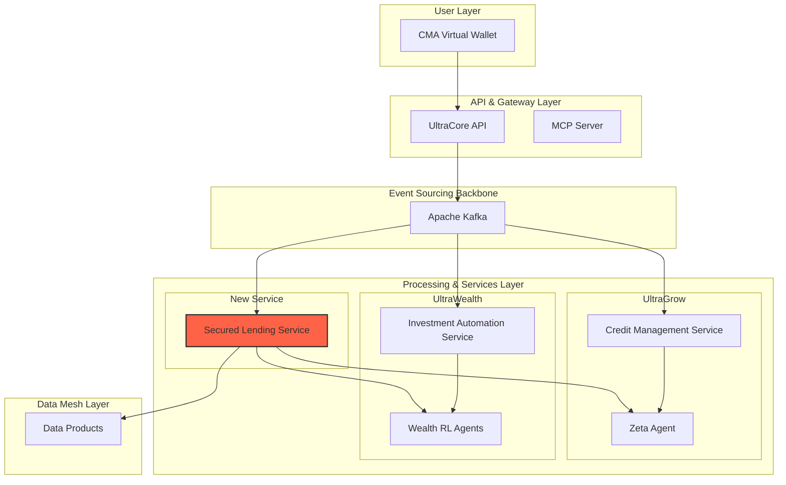

# UltraGrow Secured Lending: The Credit Flywheel

**Author:** Manus AI  
**Date:** November 15, 2025  
**Version:** 1.0.0  
**Status:** Design Proposal

---

## 1. Executive Summary

This document proposes a powerful extension to the UltraGrow module: **Portfolio-Secured Lending**. By integrating UltraGrow with the CMA Virtual Wallet and the UltraWealth investment engine, we can create a self-reinforcing "Credit Flywheel." This system will allow customers to borrow against the value of their investment portfolios, providing them with liquidity at lower interest rates while creating a significant competitive moat for the UltraCore platform.

Customers build wealth through UltraGrow's automated investing; that wealth then unlocks access to cheaper, more flexible credit, which in turn can be used for further investment or other financial needs, all within a single, seamless ecosystem.

---

## 2. The Credit Flywheel: A Virtuous Cycle

The integration of these three modules creates a powerful, self-reinforcing loop that drives customer engagement, loyalty, and lifetime value.

1.  **Invest & Grow (UltraGrow & UltraWealth):** The customer's journey begins with building credit and wealth. UltraGrow's automated investment features (Round-Up, Smart Savings) continuously channel funds into the customer's UltraWealth portfolio, which is optimized by RL agents (Alpha, Beta, Gamma, etc.) for superior returns.

2.  **Collateralize & Borrow (CMA Virtual Wallet):** As the investment portfolio grows, it becomes a valuable asset. Through the CMA Virtual Wallet, the customer can instantly see their available credit line, secured by their portfolio. They can apply for and receive a loan at a significantly lower interest rate than an unsecured loan, as the risk is backed by tangible assets.

3.  **Utilize & Repay:** The customer can use the funds for major purchases, to consolidate higher-interest debt, or even to make further strategic investments. Repayments are managed through the wallet, and positive repayment behavior further improves their UltraGrow credit profile.

4.  **Accelerate Growth:** The improved credit profile unlocks higher unsecured credit limits from UltraGrow, and the continued investment growth increases their secured borrowing power. This creates a powerful cycle of positive financial momentum.

---

## 3. System Architecture & Integration

This integration introduces a new **Secured Lending Service** and leverages the existing event-driven architecture to connect the CMA Virtual Wallet, UltraGrow, and UltraWealth.

### 3.1 High-Level Architecture Diagram

### 3.2 Component Interactions

1.  **CMA Virtual Wallet:** Acts as the primary user interface. It will feature a new "Borrow" tab that displays the customer's available secured credit line in real-time. The user applies for, receives, and manages their loan directly within the wallet.

2.  **Secured Lending Service (New Microservice):** This is the core of the new functionality. It is responsible for:
    *   **Loan Origination:** Consumes loan application events from Kafka.
    *   **Collateral Valuation:** Continuously queries the UltraWealth module to get the real-time market value and risk profile of the customer's portfolio.
    *   **LTV Calculation:** Determines the Loan-to-Value ratio based on the collateral's risk. A low-risk portfolio (e.g., Alpha Agent) might allow a 70% LTV, while a high-risk one (e.g., Delta Agent) might only allow 40%.
    *   **Risk Assessment:** Queries the **Zeta Agent** with the LTV and collateral data to get a comprehensive risk score for the secured loan.
    *   **Margin Call Logic:** Continuously monitors the portfolio value. If the value drops and the LTV breaches a threshold (e.g., 85%), it triggers a margin call event.
    *   **Loan Management:** Manages the loan lifecycle, including interest calculation, repayments, and closure.

3.  **UltraGrow (Zeta Agent):** The Zeta Agent's state space will be expanded to include collateral information. When a secured loan is requested, the Zeta Agent's role is to assess the **holistic risk**, considering both the customer's creditworthiness and the quality of the collateral. This allows for more nuanced decisions than a simple LTV calculation.

4.  **UltraWealth (Wealth RL Agents):** The UltraWealth module will expose new internal APIs for the Secured Lending Service to:
    *   Get real-time portfolio valuation.
    *   Get a detailed risk assessment of the portfolio (e.g., volatility, Sharpe ratio, asset allocation), provided by the specific agent managing it.
    *   Place a lien on the collateralized assets, preventing them from being sold while the loan is active.

---

## 4. User Journey: From Investment to Loan

1.  **View Borrowing Power:** Jane, an UltraCore customer, has been using the "Round-Up & Invest" feature for a year. Her UltraWealth portfolio, managed by the Gamma Agent, is now worth $15,000. She opens her CMA Virtual Wallet and sees a new widget: "Your Borrowing Power: $9,000".

2.  **Apply for a Loan:** Jane needs $5,000 for a home renovation. She taps the widget, enters the amount, and sees the terms instantly: "3.5% APR, secured by your Growth Portfolio." The app clearly explains that this rate is significantly lower than the 15% APR of an unsecured personal loan.

3.  **Instant Approval:** Jane accepts the terms. An event `SecuredLoanRequested` is published to Kafka. The Secured Lending Service consumes the event, queries UltraWealth for the portfolio value ($15,000), calculates the LTV (33%), and asks the Zeta Agent for a risk score. The Zeta Agent, seeing Jane's excellent payment history and the high-quality collateral, instantly approves the loan. An `SecuredLoanApproved` event is published.

4.  **Funds Disbursed:** The funds are instantly available in Jane's CMA Virtual Wallet. Simultaneously, a portion of her UltraWealth portfolio is marked as collateral and cannot be sold.

5.  **Automated Repayment:** Jane sets up automatic monthly repayments from her UltraCore checking account. Each repayment event is logged in Kafka, further improving her credit profile with the Zeta Agent.

6.  **Margin Call (Scenario):** The market experiences a downturn, and Jane's portfolio value drops to $10,000. The LTV is now 50% ($5,000 / $10,000), which is still below the margin call threshold. No action is needed. If the value dropped to $5,500, breaching the 85% LTV threshold, the Secured Lending Service would trigger a margin call, notifying Jane to add more collateral or pay down a portion of the loan.

---

## 5. Competitive Advantages of Integration

- **Seamless Experience:** A single platform for banking, investing, borrowing, and payments. No need for customers to go to a separate lender.
- **Lower Interest Rates:** By securing loans with assets already on the platform, UltraCore can offer significantly better rates than competitors, creating a powerful incentive to consolidate financial life within the ecosystem.
- **Data Supremacy:** The system leverages a holistic view of the customer's financial life—spending, saving, investing, and credit behavior—to make superior risk decisions. No standalone lender has access to this breadth of data.
- **Increased Stickiness:** A customer with an active secured loan is highly unlikely to leave the platform. The integration creates a powerful retention mechanism.
- **Revenue Diversification:** Adds a new, high-quality revenue stream (interest income from secured loans) with inherently lower risk than unsecured lending.

This integration transforms the UltraCore platform from a collection of powerful but separate modules into a deeply interconnected, synergistic ecosystem that drives immense value for both the customer and the business.
